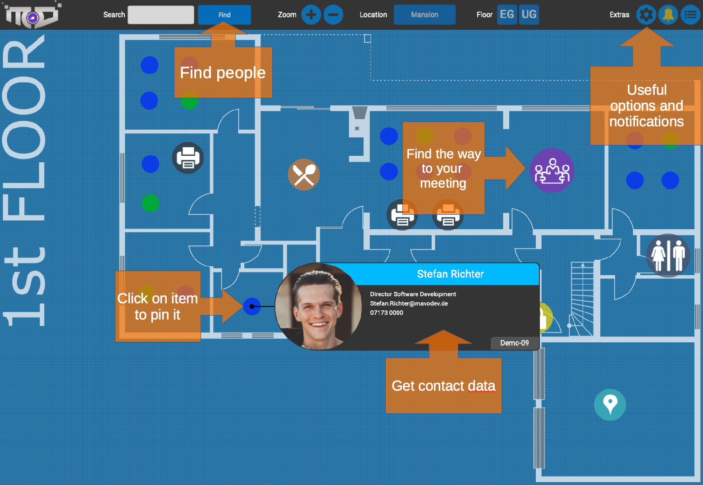
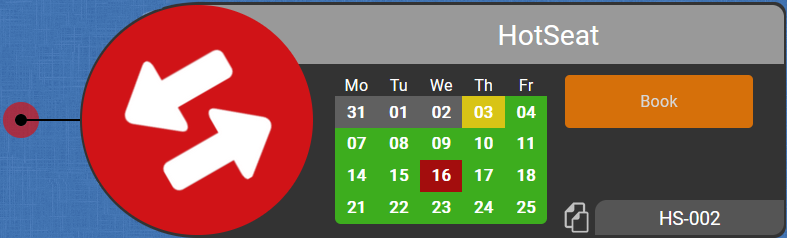

 ## Companymaps
 
Displays a map of the company with all desks and employees included. Allows full-text search and contact information. The service can be deployed on any VM running Linux - no cloud service or subscription fees required, all data stays within your network. 

Depending on your needs, it can be used for local users or integrated into your existing LDAP directory. SAML authentication via simplesamlphp is available, too. If you are in a more dynamic setup, you might be happy to hear that desk bookings are availabe as well. 

